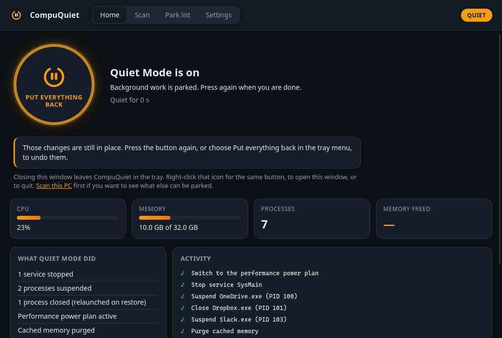
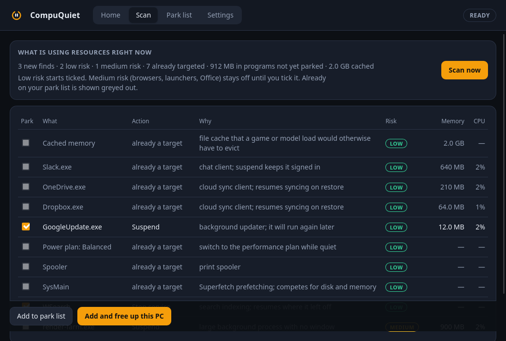

# CompuQuiet

Frees the machine for games and local AI, then puts everything back.

One switch parks the background work that competes for CPU, memory and disk:
telemetry and indexing services, sync clients, updaters, chat apps. It moves
Windows to its performance power plan and, if you turn that on, purges cached
memory once the rest is out of the way. Switching it off restores every service, resumes or
relaunches every program and returns the power plan, in reverse order. Each
step is written to an undo journal before the next one runs, so a crash or a
reboot cannot lose the list of what to put back.



## What it does

| Action | Windows | Linux | macOS |
| --- | --- | --- | --- |
| Suspend a program (frozen in place, resumed on restore) | `NtSuspendProcess` | `SIGSTOP` | `SIGSTOP` |
| Close a program and relaunch it on restore | `taskkill`, then relaunch | `SIGTERM`, then relaunch | `SIGTERM`, then relaunch |
| Stop a service and start it again | Service Control Manager (administrator) | `systemctl` (polkit for system units, `user:` prefix for user units) | `launchctl` user agents |
| Performance power plan | `powercfg` (Ultimate or High performance) | `powerprofilesctl` | not available |
| Purge cached memory (opt-in) | standby list (administrator) | `drop_caches` via polkit | not available |

The desktop shell, compositor, input, audio, security software, terminals
and CompuQuiet itself are always protected and cannot be added as targets.
Your own "never touch" list sits on top of that.

## Using it

1. Open CompuQuiet. Home shows live CPU, memory and process figures, and what
   one press will do. *Preview what one press would do right now* looks at
   the running machine and lists each program and service it would park, the
   command line a closed program reopens with, and what it would leave alone
   and why. It only looks: a press plans again from the machine as it is.
2. Open **Scan** to see what is using resources right now: recognised
   background software that is not yet on the park list, large programs with no
   window, stoppable services that are running, a non-performance power plan
   and (not on Linux, which gives its cache up on demand) a large file cache. Each row shows its cost, why it is safe and a risk
   level. Low risk starts ticked; medium risk stays off until you tick it.
   *Add and free up this PC* adds the ticked finds and parks them.
3. Review **Park list**: the built-in list of background hogs for your platform,
   with a running/not-running indicator. Add any running program by name,
   choose Suspend or Close & relaunch, add services, and save. Removing a row
   adds it to *Never touch*, so a scan does not bring it back; take it off
   that list to allow that.
4. Press the big button. With *Also park low-risk finds from a quick scan* on
   (the default), the run also parks those finds without changing your saved
   park list. The activity log shows every step and anything left alone (with
   the reason). The tray icon turns amber while Quiet Mode is on. Home then
   shows what CompuQuiet measured around the run: memory available and CPU
   before and after, and how much the suspended programs still hold. Freezing
   a program frees nothing; only closing one gives its memory back, and the
   change is approximate. On battery the performance power plan and the memory
   purge are skipped and listed as left alone, unless Settings allows them.
5. Press it again, or right-click the tray icon, to restore. Quitting while
   quiet can put everything back first.



**Windows and administrator rights.** Stopping services and purging memory
need an elevated process. CompuQuiet starts unelevated so it can run at
logon without a prompt; when a target needs elevation the dashboard offers
*Relaunch as administrator*. "Start with the system" registers a logon task.
Created from an elevated CompuQuiet that runs from Program Files (where the
installer puts it), the task starts it elevated without a prompt. From any
other folder, such as a portable copy, the task is made without
administrator rights, because a program running as you could otherwise
replace that copy and be started with administrator rights at every sign-in;
the setting says so.

**Start with the system** is available on all three platforms (logon task on
Windows, LaunchAgent on macOS, XDG autostart for the Linux AppImage). It
refuses to register a copy running from Downloads, a temporary folder or a
build directory.

## Install

Download from the [GitHub Releases page](https://github.com/Swatto86/CompuQuiet/releases).
Every release ships an installer and a portable build per platform, built by
the `release` workflow from the tagged commit after the full gate passes:

| Platform | Installer | Portable |
| --- | --- | --- |
| Windows 10/11 x64 | `CompuQuiet_<version>_x64-setup.exe` (NSIS, all users, into Program Files) | `CompuQuiet-portable-windows-x64.exe` |
| Linux x64 | `CompuQuiet_<version>_amd64.deb` | `CompuQuiet-portable-linux-x64` / `.AppImage` |
| macOS (Apple silicon) | `CompuQuiet_<version>_aarch64.dmg` | `CompuQuiet-portable-macos-arm64.app.tar.gz` |

Portable builds keep their settings and undo journal in the normal per-user
configuration folder unless `COMPUQUIET_DATA_DIR` points somewhere else,
for example a folder beside the executable on a USB stick.

The Windows installer asks for administrator permission once, because it
installs for all users. Releases up to 1.1.7 installed per user, into
`%LOCALAPPDATA%\CompuQuiet`; the new installer removes that copy and its
shortcuts, keeps your settings and undo journal (they live elsewhere), and
points an existing sign-in task at the new copy. Uninstalling removes the
sign-in task too. A portable copy is untouched: switch "Start with the
system" off before deleting one.

The Windows installer, the Linux AppImage and the macOS app check GitHub for
a newer signed release when Quiet Mode is off (at launch, then every few
hours while CompuQuiet stays running), download it, and install it and
restart once nothing is running and the window is closed to the tray. On
Windows an unelevated copy in Program Files shows the permission prompt for
that install (a notification says so first); a copy running as administrator
installs without one. The `.deb` and the portable copies do not update
themselves. Settings > About shows where that stands, and *Check now* asks
again. A copy built before
this check existed has to be replaced by hand once; after that, later
releases install on their own.

Required runtimes (shared platform components, not bundled):

- **Windows:** the [WebView2 Runtime](https://developer.microsoft.com/microsoft-edge/webview2/), present on Windows 11 and updated Windows 10.
- **Linux:** `libwebkit2gtk-4.1` and GTK 3 (the `.deb` declares them; the AppImage expects them installed). `powerprofilesctl` (with the power-profiles daemon running and offering a performance profile) and `pkexec` are optional and enable the power and memory actions.
- **macOS:** nothing beyond macOS 12 or later.

State lives in `%APPDATA%\CompuQuiet` (Windows), `~/.config/CompuQuiet`
(Linux) or `~/Library/Application Support/CompuQuiet` (macOS):
`settings.json` and, while Quiet Mode is on, `journal.json`. An
`instance.lock` file in the same folder keeps a second copy from running
beside the first.

## Building from source

Prerequisites: Rust (pinned in `rust-toolchain.toml`), Node 22+, and the
Tauri platform prerequisites for your OS (MSVC Build Tools on Windows;
`libwebkit2gtk-4.1-dev` and friends on Linux; Xcode command line tools on macOS).

```bash
npm ci
npx tauri dev                 # run with hot reload
pwsh scripts/fastcheck.ps1    # or scripts/fastcheck.sh: fmt, clippy, tsc
pwsh scripts/verify.ps1       # or scripts/verify.sh: the full gate
```

The full gate runs formatting, clippy, Rust and frontend tests, a debug build
with an in-memory fake platform, and a WebdriverIO suite that drives the real
binary through its real webview (Windows and Linux; `scripts/setup-e2e.ps1`
fetches the matching Edge WebDriver on Windows). Packaged installers are built
by `npx tauri build`, which is the release step rather than the inner loop.

## Licence

MIT. See `LICENSE`.
